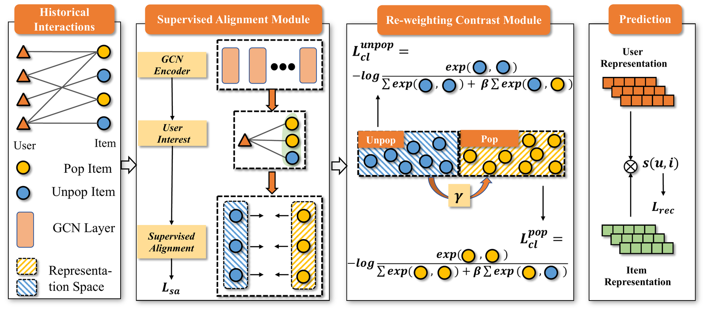

<div align="center">

# PAAC: Popularity-Aware Alignment and Contrast for Mitigating Popularity Bias

[](https://arxiv.org/abs/2405.20718)
[](https://doi.org/10.1145/3637528.3671824)
[](https://kdd2024.kdd.org/)
[](https://www.python.org/)
[](https://pytorch.org/)
[](https://github.com/miaomiao-cai2/KDD2024-PAAC)

**Official PyTorch implementation of our KDD 2024 paper**
*"Popularity-Aware Alignment and Contrast for Mitigating Popularity Bias"*

[Paper](https://doi.org/10.1145/3637528.3671824) · [arXiv](https://arxiv.org/abs/2405.20718) · [Citation](#-citation)

</div>

## 📖 Overview

Collaborative Filtering (CF) recommenders are known to suffer from **popularity bias**: because interactions in real-world datasets are long-tailed, models tend to learn much better representations for popular items than for unpopular ones, which both hurts accuracy on the long tail and reinforces the Matthew effect.

We identify two persistent challenges behind this bias:

1. **Unpopular-item overfitting** — with very few supervisory signals, representations of unpopular items are poorly learned and generalize badly to unseen interactions.
2. **Representation separation** — popular and unpopular items are pushed into distinct regions of the embedding space, which existing contrastive-learning-based debiasing methods can inadvertently worsen.

To address both issues, we propose **PAAC (Popularity-Aware Alignment and Contrast)**, which combines:

- A **popularity-aware supervised alignment** module that transfers supervisory signal from popular to unpopular items interacted with by the same user, and
- A **re-weighting contrastive learning** module that rebalances positive/negative sample weights across popularity groups to reduce representation separation.

PAAC is backbone-agnostic and introduces **no additional trainable parameters**. Instantiated on top of LightGCN, it consistently outperforms strong debiasing baselines (IPS, MACR, InvCF, Adap-τ, SimGCL) on Yelp2018, Gowalla, and Amazon-Book under an unbiased (uniformly distributed) test setting.

<p align="center">
  
</p>
<p align="center"><em>Figure: Overview of PAAC. The Supervised Alignment Module transfers supervisory signal from popular to unpopular items interacted with by the same user; the Re-weighting Contrast Module re-balances positive/negative sample weights across popularity groups before the final prediction step.</em></p>

## 🔧 Requirements

```
python == 3.9.7
pytorch == 1.12.0+cu113
numba == 0.54.1
numpy == 1.20.0
faiss-gpu == 1.7.2
pandas == 1.3.4
```

## ⚙️ Installation

```bash
# 1. Clone the repository
git clone https://github.com/miaomiao-cai2/KDD2024-PAAC.git
cd KDD2024-PAAC

# 2. Create and activate a conda environment
conda create -n paac python=3.9.7
conda activate paac

# 3. Install dependencies matching the versions above
pip install torch==1.12.0+cu113 --extra-index-url https://download.pytorch.org/whl/cu113
pip install numba==0.54.1 numpy==1.20.0 pandas==1.3.4 faiss-gpu==1.7.2
```

> A GPU with CUDA 11.3 support is recommended for `faiss-gpu` and for training at scale.

## 📁 Repository Structure

```
KDD2024-PAAC/
├── PAAC_main.py          # Entry point: training / evaluation loop and argument parsing
├── dataloader.py         # Dataset loading and preprocessing
├── mini_batch_test.py    # Mini-batch, full-ranking evaluation utilities
├── metrics.py            # Recall@K, HR@K, NDCG@K implementations
├── utils.py              # Helper functions (logging, early stopping, etc.)
├── OOD_Data/             # Unbiased (uniformly-distributed) train/val/test splits used to evaluate debiasing
├── OOD_result/           # Logs / output produced by experiment runs
├── Rebuttal/             # Additional experiments and materials from the review/rebuttal phase
└── Readme.md
```

> Directory descriptions above reflect the current repository layout — feel free to adjust the wording if any folder's actual contents differ.

## 📊 Datasets

Experiments are conducted on three public, widely-used recommendation benchmarks. Following prior debiasing work, users/items with fewer than 10 interactions are filtered out, and an **unbiased test set** (uniform item distribution) is constructed so that performance reflects debiasing ability rather than exploitation of the test set's own popularity skew.

| Dataset | #Users | #Items | #Interactions | Density |
|---|---:|---:|---:|---:|
| Amazon-Book | 52,643 | 91,599 | 2,984,108 | 0.0619% |
| Yelp2018 | 31,668 | 38,048 | 1,561,406 | 0.1300% |
| Gowalla | 29,858 | 40,981 | 1,027,370 | 0.0840% |

Sources: [Amazon-Book](https://jmcauley.ucsd.edu/data/amazon/links.html) · [Yelp2018](https://www.yelp.com/dataset) · [Gowalla](http://snap.stanford.edu/data/loc-gowalla.html)

## 🚀 Usage

PAAC uses LightGCN as its backbone encoder. Example commands for the datasets currently configured in this repository:

### Yelp2018

```bash
python PAAC_main.py --dataset_name yelp2018 \
    --layers_list '[5]' \
    --cl_rate_list '[10]' \
    --align_reg_list '[1e3]' \
    --lambada_list '[0.8]' \
    --gama_list '[0.8]'
```

### Gowalla

```bash
python PAAC_main.py --dataset_name gowalla \
    --layers_list '[6]' \
    --cl_rate_list '[5]' \
    --align_reg_list '[50]' \
    --lambada_list '[0.2]' \
    --gama_list '[0.2]'
```

### Amazon-Book

Not yet included as a preset command in this repository — tune `--align_reg_list`, `--cl_rate_list`, `--lambada_list`, and `--gama_list` within the ranges reported in [Hyperparameters](#-hyperparameters) below, following the same syntax as the examples above.

**Argument reference:**

| Argument | Meaning |
|---|---|
| `--layers_list` | Number of LightGCN propagation layers |
| `--cl_rate_list` | Weight of the re-weighting contrastive loss |
| `--align_reg_list` | Weight of the popularity-aware supervised alignment loss |
| `--lambada_list` | Positive-sample re-weighting coefficient (popular vs. unpopular) |
| `--gama_list` | Negative-sample re-weighting coefficient (popular vs. unpopular) |

Each argument accepts a list so that multiple values can be swept in a single run.

## 🎛️ Hyperparameters

Default training setup used in the paper:

| Setting | Value |
|---|---|
| Embedding size | 64 |
| Optimizer | Adam, lr = 0.001 |
| Batch size | 2048 |
| L2 regularization weight | 1e-4 |
| Mini-batch grouping ratio | 50% |
| Search range: align_reg | {1, 5, 10, 50, 100, 300, 400, 500, 1000} |
| Search range: cl_rate | {0.1, 1, 5, 10, 20} |
| Search range: lambada / gama | {0, 0.2, 0.4, 0.5, 0.6, 0.8, 1.0} |

## 📝 Citation

If you find this work or code useful for your research, please cite our paper:

```bibtex
@inproceedings{cai2024paac,
  author    = {Cai, Miaomiao and Chen, Lei and Wang, Yifan and Bai, Haoyue and Sun, Peijie and Wu, Le and Zhang, Min and Wang, Meng},
  title     = {Popularity-Aware Alignment and Contrast for Mitigating Popularity Bias},
  booktitle = {Proceedings of the 30th ACM SIGKDD Conference on Knowledge Discovery and Data Mining (KDD '24)},
  year      = {2024},
  pages     = {},
  publisher = {ACM},
  address   = {Barcelona, Spain},
  doi       = {10.1145/3637528.3671824}
}
```

## 📄 License

No license file is currently included in this repository. If you intend to release this code under an open-source license (e.g., MIT or Apache-2.0), please add a `LICENSE` file at the repository root — this makes reuse terms explicit for others building on this work.

## 📬 Contact

For questions about the paper or code, please open a [GitHub issue](https://github.com/miaomiao-cai2/KDD2024-PAAC/issues).
